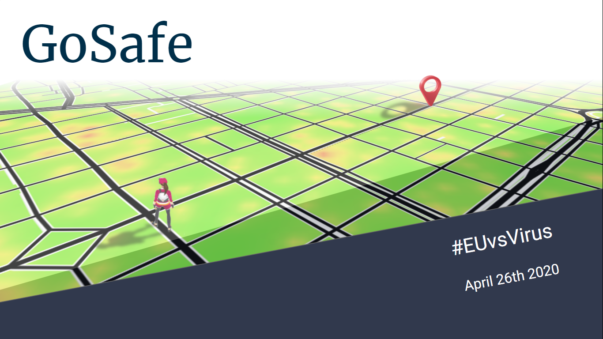

## Inspiration
Children need to play outside for a healthy growth. After a long period of confinement and with new social distancing rules, the experience of returning to the streets can be hard for a lot of them. **GoSafe** offers a solution to this situation. It consists on a path-finder game app designed for helping children have fun outside while helping them keep social distancing best practices.

## What it does
**GoSafe** challenges children to go on different *expeditions* to different locations around them. It does it in a game manner where they follow a story where they are the main characters. The players are rewarded by avoiding *danger zones* and by completing the different tasks the game proposes.

In the back-end, **GoSafe** is continuously calculating which areas in the city are the safest for the children to be in. It helps children avoid areas such as hospitals, stores and train stations, to avoid big concentrations of people. It also avoids direct contact with other **GoSafe** players, by allowing them to communicate through the app and work together on connected missions.

**GoSafe** also allows city administrators to add new danger zones and redirect people according to the local knowledge and specific needs. It can also be used as a tool to make decisions on confinement management and public health matters.

## How we built it
### Dataset
We started downloading up to 13000 POI locations from the [Barcelona Open Data Portal](https://opendata-ajuntament.barcelona.cat/data/en/dataset), including bus, metro, train, tram stations, hospitals, clinics, supermarkets, grocery shops, libraries, etc. We want kids as far away as possible from crowded places, and accordingly we have assigned risk scores to each category. Using `python` and `QGIS`, we have created risk matrices for each category in `netCDF` format, each score element covering an area of 10x10 meters. Adding up all the matrices multiplied by its score (category risk score) we finally got the CoVid-19 risk map for barcelona. We scaled the values and applied a color ramp to create an image using `OpenCV`. Scripts used can be found in the [GoSave github](https://github.com/gosafe-euvsvirus/gosafe-euvsvirus.github.io). To share the risk map we created a [GoSave map](https://gosafe-euvsvirus.github.io/) through a simple `Leaflet` application. 

### Back-end ops
All the `netCDF` files are stored in the back-end so when the client request a position score through the API, it can answer as fast as possible. These score matrices are also looked up when the player stats a new game. In this case, an algo choose a random route destination, located between 600 and 800 meters from the origin and checking that the proposed location has an associated risk above a threshold. The back-end also stores each new possition sent by the client during a walk so at the end it can send total score and store past walks in a `MongoDB` database.

### API
The **GoSafe** system is based on a `REST API`, which has been published following the Open API specification and available on [`Swaggerhub`](https://app.swaggerhub.com/apis/jaumebrossa/GoSafeAPI/1.0.0#/):

**game** *(Everything used while playing)*
* **GET** **/game/destination/{start}** --> Get destination for the current game
* **GET** **/game/score/{position}** --> Get actual score for current position
* **POST** **/game/score/{position}** --> Post current position
* **GET** **/game/totalscore/** --> Get total score for current game

**user** *(Operations about user)*
* **POST** **/user** --> Logs out current logged in user session
* **GET** **/user/login** --> Logs user into the system
* **GET** **/user/logout** --> Logs out current logged session
* **GET** **/user/pastroutes/** --> Get historic of past routes
* **GET** **/user/pastscores/** --> Get historic of past scores
* **GET** **/user/{username}** --> Get user by username
* **PUT** **/user/{username}** --> Update user
* **DELETE** **/user/{username}** --> Delete user
* **GET** **/game/destination/{start}** --> Get destination for the current game

**decision** *(Reports and utilities used for social public safety administrations)*
* **GET** **/decision/allroutes/{date}** --> Returns all routes performed in the given day
* **GET** **/decision/dangerzones** --> Returns all danger zones with their scores
* **POST** **/decision/dangerzones** --> Post new danger zones to be included in the app

## Challenges we ran into
* **Project scope** We're a heterogeneous team in terms of age and context, so we've first addressed the identification of the challenge objective and the framing of a solution presenting an impact solution both for kids and decision-makers.
* **Mechanics of the game** We've devoted a significant amount of effort to come up with an actual location-based game designed for the specific purpose of managing children mobility while keeping social distance.
* **UX aspects** We've also defined wireframes for the key user interfaces in our system. Such interfaces must promote engagement and adoption amongst children, whilst providing also background information on safe social distancing practices and aggregated data for decision making
* Specify, prototype implementation and testing **key system logics**: next destination, scoring of a location
* **Key system backend processes** We've addressed and prototyped the key backend processes around geospatial data analysis (area density, scoring of a location). Although not totally implemented, the code build we've reached already presents a feasible and scalable software solution for the user stories in scope.

## Accomplishments that we are proud of
Team work. Relevant goal. Innovative solution. Meaningful stack

## What we learned
* We've learned that people comes first, and the tech provides a solution. A highly relevant use case with a good enough tech is much better than a superb tech addressing a non-existing problem
* We've learned that lateral thinking is always good, and that moving beyond your confort zone (Machine Learning, sotware engineering...) helps to improve the quality and innovation of what you're building
* We've learned (again) that hacking together is great

## What's next for GoSafe
**GoSafe** is currently an idea under development. As future steps, it needs to move from a prototype to a fully functional application by working on its front-end and story design.
**GoSafe** provides the foundations for a web application that can be used by children, family and by city administrators to help stop the spread of the virus.
